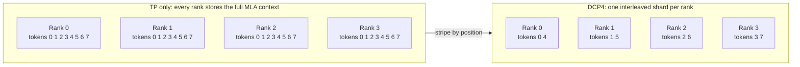
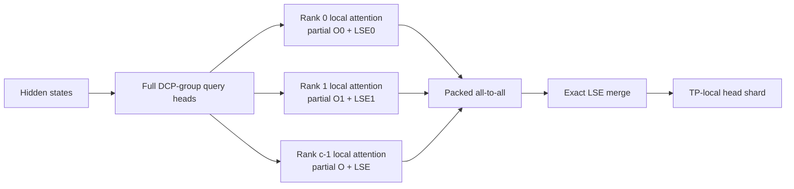

Decode context parallelism (DCP) stripes a request's MLA KV cache across ranks in an existing tensor-parallel group. With DCP size `c`, rank `r` owns position `p` when `p mod c = r`, so each rank stores and reads roughly `1/c` of the cache.

Local attention then sees only part of the context. The MLA path returns a partial output and log-sum-exp (LSE), exchanges both in one packed all-to-all, and merges them exactly. DCP complements TP and [attention data parallelism (DPA)](/docs/advanced_features/dp_dpa_smg_guide) rather than replacing them. The primary path is absorbed MLA decode and static target verification. `dcp_size=1` retains existing non-DCP behavior.

On Kimi K3, DCP applies only to MLA layers. Request-indexed KDA state is unchanged, so DCP grows long-context KV capacity but does not raise the KDA concurrency ceiling.

## Enable DCP

| Setting | Behavior |
| --- | --- |
| `--dcp-size N` | Enables DCP and widens virtual capacity and page size by `N`. Alias: `--decode-context-parallel-size`. |
| `--dcp-comm-backend` | Selects the MLA partial-output merge: `ag_rs`, `a2a`, or `fi_a2a`. |
| `--dcp-replicate-q-proj` | Removes the query all-gather for supported MLA weights. Use `--no-dcp-replicate-q-proj` to disable a model-specific default. |
| `--enable-dp-attention` | Composes only when DCP groups nest inside attention TP. |

A DCP group must fit inside one attention-TP group and one attention-DP replica:

```text Topology
attn_tp_size = tp_size / attn_dp_size
attn_tp_size % dcp_size == 0
```

For example, `TP=64, DP=4, DCP=16` creates four valid 16-rank attention replicas. `DCP=32` would cross replica boundaries and is invalid.

<Warning>
Startup currently checks only `tp_size % dcp_size == 0`, not the stronger condition above. Until that check is fixed, DPA+DCP deployments must enforce containment when choosing the topology.
</Warning>

MLA decode on DeepSeek-V3.1 with DCP 8 inside TP 8:

```bash Command
sglang serve \
  --model-path deepseek-ai/DeepSeek-V3.1 \
  --trust-remote-code \
  --tp-size 8 \
  --dcp-size 8 \
  --host 0.0.0.0 \
  --port 30000
```

Kimi K3 on 32 GPUs with DPA and DCP 8. The model override enables replicated Q by default and picks `fi_a2a` on MNNVL systems, otherwise `a2a`:

```bash Command
sglang serve \
  --trust-remote-code \
  --model-path moonshotai/Kimi-K3 \
  --tp-size 32 \
  --ep-size 32 \
  --enable-dp-attention \
  --dp-size 4 \
  --dcp-size 8 \
  --host 0.0.0.0 \
  --port 30000
```

See the [Kimi K3 cookbook](/cookbook/autoregressive/Moonshotai/Kimi-K3) for large-scale presets that combine DCP with DPA and expert parallelism.

### Kimi-K3 on ROCm

Kimi-K3 supports Triton MLA DCP on ROCm, including static speculative verification. The model gathers or replicates the query heads, Triton computes owner-local attention and natural-log LSE, and the existing RCCL all-to-all merge restores the TP-local heads.

Example for eight gfx942 GPUs with 256 GiB per GPU:

```bash Command
SGLANG_USE_AITER=1 \
SGLANG_AITER_K3_OPT=1 \
SGLANG_AITER_MXFP4_TRITON=1 \
SGLANG_MLA_DECODE_TUNE=1 \
ROCM_QUICK_REDUCE_QUANTIZATION=NONE \
sglang serve \
  --model-path /path/to/Kimi-K3 \
  --trust-remote-code \
  --tp-size 8 \
  --dcp-size 8 \
  --attention-backend triton \
  --kv-cache-dtype fp8_e4m3 \
  --dtype bfloat16 \
  --mamba-ssm-dtype float32 \
  --linear-attn-prefill-backend triton \
  --linear-attn-decode-backend triton \
  --mem-fraction-static 0.85 \
  --context-length 1048576 \
  --max-total-tokens 131072 \
  --max-running-requests 64 \
  --cuda-graph-max-bs-decode 64 \
  --chunked-prefill-size 65536 \
  --max-prefill-tokens 120000 \
  --disable-radix-cache
```

For the static target pool, `--max-total-tokens` caps **physical rows per rank**. DCP8 with 131,072 physical rows exposes 1,048,576 logical token slots; setting the physical cap to 1,048,576 instead exposes an 8M-token logical space and also enlarges the replicated draft cache. Leave room for generated tokens within the logical capacity.

DFlash2 can be added with its usual draft-model, block-size, draft-window and ReplaySSM settings. Its cache remains replicated, including when the draft uses MLA. The runtime draft-history window does not limit the target's context or shrink the draft pool's allocated ID space.

On gfx942, supported ordinary prefill uses bounded MHA prefix chunks even for short cached prefixes. This avoids a full-head absorbed-attention workspace that can exhaust memory on mixed prefill batches. Decode and speculative verification remain graph-captured; DCP does not imply faster prefill.

For the gfx942 MXFP4 checkpoint path, keep `SGLANG_USE_AITER=1` and `SGLANG_AITER_K3_OPT=1`. The latter avoids unnecessary TP8 expert-width padding. `SGLANG_AITER_MXFP4_TRITON=1` explicitly selects the BF16-activation compatibility path, which is also selected automatically on gfx942. Keep `ROCM_QUICK_REDUCE_QUANTIZATION=NONE` to avoid quantized quick-reduce communication.

Do not treat `SGLANG_MLA_DECODE_TUNE=1` as evidence that every MLA shape is tuned: its gfx942 specialization requires 12 query heads and batch four, whereas this TP8/DCP8 target computes 96 query heads per rank. The separate gfx942 DCP verification tiling is selected automatically.

On gfx942 with Triton 3.6, 96-head DCP8 verification of up to 16 tokens per request with FP8 KV and BF16 queries uses batch-aware value tiles: 256 channels for a single request and 512 for batches of 2–64 requests. This avoids repeating query-key work across four value tiles while retaining the serial 64-token prefix traversal, FP8 rounding, and FP32 partial outputs. Other configurations retain the existing tiling; no additional flag is required.

With DFlash block eight, `--linear-replayssm-cache-len 16` meets the KDA ring's minimum size of twice the verification width. This ring is speculative rollback storage, not a truncation of recurrent history; keep `--mamba-ssm-dtype float32`. Larger request and graph limits reserve additional KDA state and graph memory without enlarging the aggregate logical KV pool. Benchmark prefill chunk size separately: smaller chunks reduce transient memory but can increase long-prompt latency.

## Why decode context parallelism?

Absorbed MLA shares one latent KV representation across all query heads. TP can split the heads and weights, but not that cache, so every attention-TP rank stores and reads the same context.



DCP stripes that cache round-robin by logical token position, keeps a shared virtual index on every rank, runs attention against the owner-local shard, and merges partial outputs by LSE into the usual TP-local head layout.

## Architecture

### Virtual KV layout

Let each rank have physical token capacity `C` and physical page size `P`. DCP exposes a shared virtual allocator:

```text Layout
virtual capacity  = C * c
virtual page size = P * c
owner(v)          = v mod c
physical(v)       = floor(v / c)
```

Every rank sees the same request-to-token map. On write, it keeps its positions and compacts them into the local physical pool. One widened virtual page maps to one physical page on each rank, so the layout stays balanced to within one token as a sequence grows.

### MLA decode dataflow



For context partition `r`, the kernel returns locally normalized output `o_r` and `lse_r`. The global result is `lse = logsumexp_r(lse_r)` and `o = sum_r(exp(lse_r - lse) * o_r)`. This is exact aside from floating-point reduction order. The merge uses the attention backend's LSE base, either base-e or base-2.

### Query-projection replication

Normally each layer all-gathers its absorbed and rotary query components. `--dcp-replicate-q-proj` gathers the query-projection and `w_kc` weights once at startup and computes the full DCP-group query locally. The trade is more weight memory and GEMM work for one fewer collective per layer. Only unquantized BF16/FP16 weights use this path; other layers fall back to the query all-gather.

### Communication backends

| Backend | DCP collectives per MLA layer | Notes |
| --- | --- | --- |
| `ag_rs` | Query AG + LSE AG + FP32 output RS | Generic fallback |
| `a2a`, gathered Q | Query AG + packed NCCL A2A | Two collectives |
| `a2a`, replicated Q | One packed NCCL A2A | Canonical low-latency path |
| `fi_a2a`, replicated Q | One FlashInfer MNNVL A2A | Requires CUDA, SM90+, and MNNVL fabric |

Kimi K3 enables replicated Q by default and picks `fi_a2a` on MNNVL systems, otherwise `a2a`. Its default decode backend is `cutedsl_mla` on CUDA and `triton` on ROCm. The generic defaults remain `ag_rs` and model-resolved query replication.

DCP adds a context-independent decode collective while cutting context-dependent KV storage and reads by about `c`. Extend is outside that decode cost model: it may gather cached prefix shards, restore token order, and append new tokens, and that work grows with prefix length.

## Compositions

### DCP × speculative decoding

The draft KV cache is replicated: every DCP rank stores the full draft context. DCP only stripes the target MLA KV, so it saves target cache, not draft cache.

On CUDA, target verify and decode use the DCP-aware MLA kernel `cutedsl_mla`. It:

1. Builds a rank-local page table from the cyclic token map (`owner(p) = p mod c`).
2. Runs attention against that shard, passing `cp_world`, `cp_rank`, and the global KV lengths so causality still sees the full sequence.
3. Returns a rank-local `(output, LSE)` that the usual DCP all-to-all merge combines.

On ROCm, Triton builds rank-local prefix indices and filters fresh verification tokens by their global positions, preserving causal masks across shard boundaries. Empty local shards contribute zero output and LSE `-inf`. Static graph replay updates both the local indices and the global prefix lengths.

Draft steps use replicated caches and skip target DCP sharding. Kimi K3 selects the platform-appropriate backend automatically when none is specified.

### DCP × PD disaggregation

A dense prefill page cannot be copied directly into striped decode storage. The PD sender uses the decode rank's DCP metadata to select and pack the right rows. See [PD disaggregation](/docs/advanced_features/pd_disaggregation) for the transfer engines.

- Equal DCP sizes require matching DCP ranks and use the existing page path.
- DCP1 prefill to DCP decode uses token relayout for MLA and hybrid-MLA pools.
- All other DCP-size transitions are rejected.

The plan includes the exact token count, so stale rows do not leak out of a partial final page. Mooncake and NIXL use the same plan. KDA state keeps its attention-TP mapping and bypasses DCP filtering.

This composition requires Mooncake or NIXL, matching physical page size and KV dtype, prefill attention CP `1`, and decode chunk cache. Decode radix cache and HiCache are not supported here.

### DCP × HiCache L2

HiCache keeps one widened logical page space across L1 and L2. The controller sees `P * c` slots, while each GPU and host buffer stores only its `P` local rows. See [HiCache](/docs/advanced_features/hicache) for the cache hierarchy.

Before H2D or D2H, both index lists keep positions owned by this rank and map `i` to `floor(i / c)`. Transfers cover whole widened pages, and every rank moves its shard independently, with no DCP collective. For Kimi K3 this applies to MLA KV; KDA/Mamba state uses its own request-indexed host pool.

The current scope is MLA L1/L2. L3, LMCache, HiSparse, non-MLA KV host pools, speculative decoding, and PD decode are not supported in this combination.

## References

- [DCP and Helix Parallelism roadmap](https://github.com/sgl-project/sglang/issues/29736)
- [SGLang and Miles Add Day-0 Support for Kimi K3](https://www.lmsys.org/blog/2026-07-27-kimi-k3-day0-support#decode-context-parallelism)
- [Original SGLang DCP design](https://docs.google.com/document/d/1pjBSID0palpuI7rx8Ck7Z0BcyzBXAgnkDrf9uQg0uqU/edit?tab=t.0)
